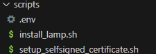
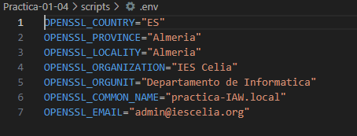
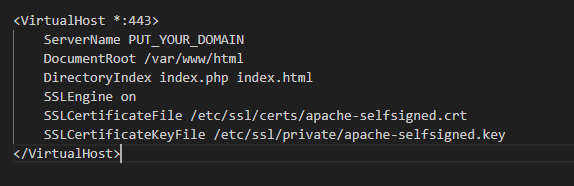
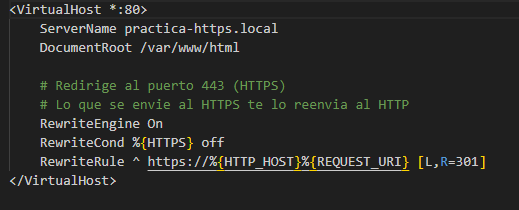

# Practica-01-04

### Creación y configuración de un certificado SSL/TLS autofirmado | Apache

Para esta practica habráque crear un certificado autofirmado por nosotros, sin una autoridad certificadora (no recomendable), para ello se hará uso de la herramienta ``openssl``. Para crear y configurar dicho proceso habrá que:

1. Crear una clave privada y un certificado autofirmado.
2. Configurar la clave privada y el certificado autofirmado en el servidor web.

## 1. Inicial:

Primeramente empezaré configurando dentro de la una carpeta llamada *scripts*, 2 archivos **.sh** el primero será donde se realizará lo que concierne a la instalación de la pila **LAMP** (install_lamp.sh) y el segundo para la configuración y creación de **certificado** y la **clave privada** (setup_selfsigned_certificate.sh).



### 1.1 Configuraciones iniciales:

Desde el script de *install_lamp.sh* es donde se realizarán las configuraciones iniciales, ya que necesitaremos tener instalado el servidor **Apache** para que utilice el **certificado** que vamos a crear. A continuación se muestra el siguiente comando para que vaya mostrando los comandos que se ejecutan:

#### Mostrar comandos:

```
set -x
```

#### Actualización de paquetes y repositorios:

Con el siguiente comando podemos realizar la actualización de la lista de paquetes:

```
apt update -y
```

## 2. Implantación de la pila:

Con el siguiente comando se realiza la instalación del **Apache**, y el parámetro **-y** es para que no salga la pregunta de confirmación:

```
apt install apache2 -y
```

### 2.2 Instalación de MySQL-Server:

Empleando este comando pasaré con la instalación de MySQL, y el parámetro **-y** es para que no salga la pregunta de confirmación:

```
apt install mysql-server -y
```

### 2.3 Instalación de PHP:

Empleando este comando pasaré con la instalación de **PHP**, junto a ciertos componentes que lo enlazan con el mysql, y el parámetro **-y** es para que no salga la pregunta de confirmación:

```
apt install php libapache2-mod-php php-mysql -y
```

### 2.4 Copiado del archivo .conf al apache:

Para automatizar esta tarea se puede realizar el copiado de la configuración hacia el **sites-available** (sitios disponibles):


```
cp ../conf/000-default.conf /etc/apache2/sites-available 
```

### 2.5 Copiado del archivo .index.php:

Con este comando copiamos el **index.php** que contiene el contenido sobre la versión del php hacia **/var/www/html** para que salga en el navegador a la hora de poner la ip:

```
cp ../php/index.php /var/www/html
```

## 3. Creación y configuración del certificado autofirmado:

En la carpeta *scripts* debemos de tener un archivo **.env** donde estarán alojadas las variables para automatizar la tarea de la emisión del certificado autofirmado:




### 3.1 Creación del certificado autofirmado

haciendo uso del siguiente comando podemos realizar la creación del certificado autofirmado de una manera automatizada. 

1. En el parámetro ``-x509`` se estaría indicando que es un **certificado autofirmado**, y no una solictud a una **CA**.

2. En el parámetro ``-nodes`` se estaria indicando que la clave privada viaja sin encriptar (sin introducción de contraseña por las apps).

3. En el parámetro ``-newkey`` se indica el **algoritmo** y **longitud** de la **clave privada**.

4. En el parámetro ``-keyout`` nos dice la **ruta** y **nombre del archivo** donde se aloja la **clave privada**.

5. En el parámetro ``-out`` nos dice la **ruta** y **nombre del archivo** donde se aloja el **certificado**.

6. Las **variables** de abajo corresponden a los valores delo **.env**.

```
openssl req \
  -x509 \
  -nodes \
  -days 365 \
  -newkey rsa:2048 \
  -keyout /etc/ssl/private/apache-selfsigned.key \
  -out /etc/ssl/certs/apache-selfsigned.crt \
  -subj "/C=$OPENSSL_COUNTRY/ST=$OPENSSL_PROVINCE/L=$OPENSSL_LOCALITY/O=$OPENSSL_ORGANIZATION/OU=$OPENSSL_ORGUNIT/CN=$OPENSSL_COMMON_NAME/emailAddress=$OPENSSL_EMAIL"
```

### 3.2 Archivo de configuración de apache para HTTPS

Dentro de la carpeta *conf* tendremos otro archivo que será destinado a la configuración de un VirtualHost que permita a todas las direcciones navegar por **HTTP``S``** mediante el archivo por defecto que tiene apache para **SSL/TLS**.
 


Dentro de este archivo Configuraremos que el **SSL** este habilitado para el VirtualHost mediante **SSLEngine** puesto a **on** 

Mediante el **SSLCertificateFile** se le estaria indicando la ruta donde esta alojado el certificado.

Con **SSLCertificateKeyFile** le digo en que ubicación se encuentra la clave pública.



### 3.3 Copiado del VirtualHost con SSL hacia /etc/apache2/sites-available

Copiamos el archivo de configuracion de Apache para HTTPS:

```
  cp ../conf/default-ssl.conf /etc/apache2/sites-available
```
### 3.4 Nombre del dominio

Haciendo uso de este comando puedo sustituir la cadena *PUT_YOUR_DOMAIN* por la variable que contiene el nombre de dominio personalizado en el **.env**, dentro del archivo de configuración del **VirtualHost** de forma automatizada:

```
sed -i "s/PUT_YOUR_DOMAIN/$OPENSSL_COMMON_NAME/" /etc/apache2/sites-available/default-ssl.conf
```

Tras ello **habilitamos** el **sitio** y tambien el **módulo ssl**

```
a2ensite default-ssl.conf
```
```
a2enmod ssl
```
### 3.5 Redirección de HTTP hacia HTTPS

El archivo **000-default.conf** estará configurado de tal forma que permita la redirección de **HTTP** hacia **HTTPS**. Se establecen una serie condiciones para evaluar si el trafico es **seguro** o **inseguro**, en caso de ser **inseguro** pasa a la siguiente línea, la cual es ua **expresión regular** que indica que debe empezar por **https://** y seguidamente se indica el **nombre de dominio** y la **URL** mediante variables. 



Para que se aplique dicha redirección habilitamos el modulo **rewrite**:

```
a2enmod rewrite
```